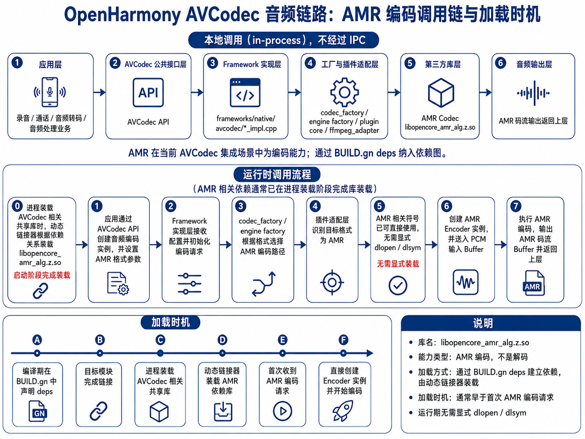

# Opencore-AMR 音频库（libopencore_amr_alg.z.so）

## 简介
`Opencore-AMR` 是一个开源 AMR（Adaptive Multi-Rate）音频编码第三方库。在当前 OpenHarmony AVCodec 集成场景中，应用无需直接集成此库，通过 AVCodec Kit API 即可调用到本库提供的 AMR 编码能力，编译产物为 `libopencore_amr_alg.z.so`。

- **框架集成**：AVCodec 通过 BUILD.gn deps 链接方式将 AMR 编码库纳入依赖图，运行时由动态链接器在进程装载阶段自动完成库装载，无需运行期手动 `dlopen` / `dlsym`。

## 1. 系统架构（AVCodec 集成）
AMR 在 AVCodec 音频编码链路中的调用关系如下：

应用层 → AVCodec 公共接口层 → Framework 实现层 → 工厂/插件适配层 → `libopencore_amr_alg.z.so` → AMR 码流输出层

- **应用层**：录音、音频转码或其他音频处理业务。
- **AVCodec 公共接口层**：AVCodec API，对外提供统一音频编码能力入口。
- **Framework 实现层**：负责参数解析、实例创建、Buffer 管理及状态流转。
- **工厂/插件适配层**：根据 MIME、编码类型等信息选择 AMR 编码路径。
- **第三方库层**：`libopencore_amr_alg.z.so`，提供 AMR 编码核心实现。
- **AMR 码流输出层**：输出 AMR 编码码流。

## 2. AVCodec 运行时调用流程
**库装载时机**：进程装载 AVCodec 相关共享库时，动态链接器根据 BUILD.gn 依赖关系自动装载 `libopencore_amr_alg.z.so`，AMR 编码相关接口可直接调用，无需运行时手动加载。

**编码调用流程**：
1. 应用通过 AVCodec API 创建音频编码实例，并设置 AMR 格式参数。
2. Framework 实现层接收配置并初始化编码请求。
3. `codec_factory` / `engine factory` 根据格式选择 AMR 编码路径。
4. 插件适配层识别目标格式为 AMR。
5. 创建 AMR Encoder 实例，并送入 PCM 输入 Buffer。
6. 执行 AMR 编码，输出 AMR 码流 Buffer 并返回上层。

<div align="center">
  
  <br>
  <b>图 1</b> AMR调用流程图
</div>
<br>

**说明**：AMR 在 AVCodec 中为编码链路。`libopencore_amr_alg.z.so` 通过 BUILD.gn deps 进入依赖图，库装载发生在进程装载相关共享库阶段，而不是首次编码时再通过 `dlopen` 装载。

## 3. 仓目录结构
```text
/foundation/multimedia/third_party_opencore-amr
├── BUILD.gn             # OpenHarmony 编译配置
├── README.OpenSource    # OpenHarmony 开源合规说明
├── bundle.json          # OpenHarmony 部件描述文件
├── OAT.xml              # OpenHarmony OAT 扫描配置
├── src/                 # Opencore-AMR 源码及 demo
├── include/             # Opencore-AMR 头文件
└── test/                # 测试代码
```

## 4. 编译构建
### 编译 64 位 ARM 目标
```bash
./build.sh --product-name {product_name} --ccache --target-cpu arm64 --build-target third_party_opencore-amr
```

> `{product_name}` 为当前支持的平台名称，例如 `rk3568`。

### 编译产物
构建完成后生成 AMR 编码动态库：

```text
libopencore_amr_alg.z.so
```

## 5. 使用示例
- **AVCodec 使用**：详见 `av_codec demo`。

## 6. 注意事项
- `libopencore_amr_alg.z.so` 为 Opencore-AMR 在 OpenHarmony 中的动态库产物名称。
- 当前 AVCodec 集成场景中，AMR 仅提供编码能力，不包含解码能力。
- AVCodec 音频软编码链路为本地调用链路，不经过 IPC。
- AMR 通过 BUILD.gn deps 纳入依赖图，运行期无需显式 `dlopen` / `dlsym`。
- **OpenHarmony 特有文件**：仓库中存在 `bundle.json`、`OAT.xml`、`README.OpenSource`、`BUILD.gn`，这些文件为 OpenHarmony 社区添加或修改，用于部件描述、OAT 扫描、开源合规说明和 GN 构建集成。
